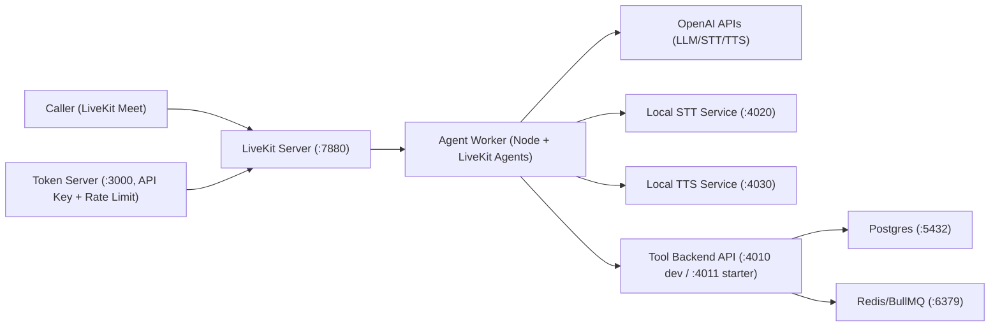
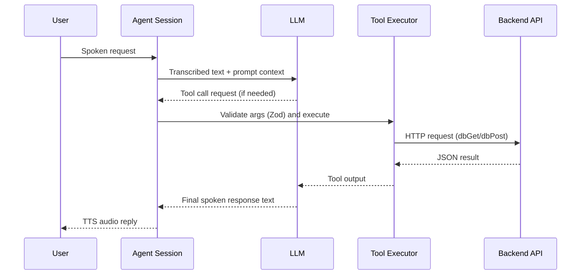

# Architecture

## Goal

Deliver a real-time VA-focused voice assistant over LiveKit that can:

- Answer VA-related questions with a system prompt policy.
- Call backend tools for search, contact capture, appointment flows, and call actions.
- Run with OpenAI STT/TTS/LLM or local STT/TTS fallback services.

## High-level topology

## Component map

| Component | Responsibility | Code |
| --- | --- | --- |
| Token server | Issues JWT token, dispatches agent to room, enforces API key/rate limits | `apps/token-server/src/index.ts` |
| LiveKit server | WebRTC signaling/media routing, worker dispatch | `docker-compose.yml` |
| Agent worker | LLM orchestration, STT/TTS, tool invocation, session lifecycle | `apps/agent-worker/src/agent.ts` |
| DB API mock | Tool endpoints for search/contact/appointments/calendar/retell actions | `apps/db-mock/src/index.ts` |
| Tools API starter | Production-oriented backend baseline with Postgres + BullMQ outbox + bearer auth | `apps/tools-api-starter/src/index.ts` |
| stt-svc / tts-svc | Optional local fallback STT/TTS services (`local-audio` profile) | `apps/stt-svc`, `apps/tts-svc` |
| Prompt | Behavioral policy and scope | `apps/agent-worker/prompt.md` |

## End-to-end runtime flow

1. Client requests token from `/token`.
2. Token server injects `RoomAgentDispatch` with `agentName`.
3. Caller joins room in LiveKit Meet using issued token.
4. LiveKit dispatches job to agent worker.
5. Agent session starts, loads prompt, and starts VAD turn handling.
6. User speech transcribes (OpenAI STT or local fallback).
7. LLM generates response and optionally tool calls.
8. Tool calls hit backend endpoints with optional bearer auth, outputs return to LLM.
9. Final text is synthesized to speech (OpenAI TTS or local fallback).
10. Audio plays back to caller.

## Tool call sequence

## Current tool surface

Defined in `apps/agent-worker/src/agent.ts`:

- `db_search`
- `save_contact`
- `create_appointment`
- `check_availability_cal`
- `book_appointment_cal`
- `send_call_summary_email`
- `transfer_call`
- `press_digit_medrics`
- `end_call`

Backed by endpoints in `apps/tools-api-starter/src/index.ts` (and compatible `db-mock` subset for local dev):

- `POST /kb/search` (primary retrieval path in `tools-api-starter`)
- `GET /search` (legacy compatibility endpoint)
- `POST /contact`
- `POST /appointments`
- `POST /calendar/availability`
- `POST /calendar/book`
- `POST /retell/send_call_summary_email`
- `POST /retell/transfer_call`
- `POST /retell/press_digit_medrics`
- `POST /retell/end_call`

Knowledge ingestion endpoints in `tools-api-starter`:

- `POST /kb/ingest`
- `GET /kb/documents`

## Session and logging hooks

`AgentSession` event listeners already log:

- Final STT: `[agent-session:stt] ...`
- Agent/user state transitions.
- Tool execution summary: `[agent-session:tools] ...`
- Session errors: `[agent-session:error] ...`

These are the primary signals for validating tool behavior and conversational stability.

## Known operational behavior from latest test

- Core flow is stable: room join, STT, tool path, TTS all worked.
- Under rapid barge-in, frequent interruptions can produce:
  - `Request was aborted` in TTS path.
  - `MaxListenersExceededWarning` warnings.
- Mitigation is primarily voice tuning (documented in `TUNING.md`).
